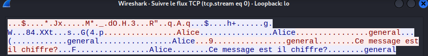
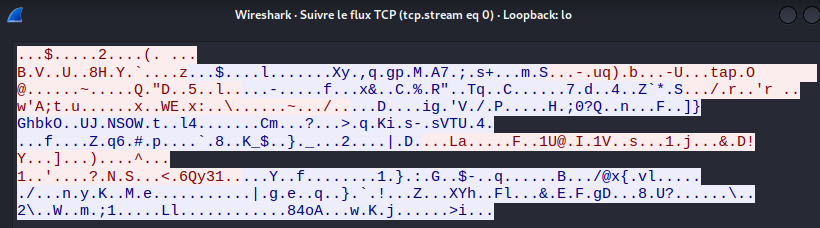

# Projet Rust

## Auteur: Aboulkader MOUSSA MOHAMED

## `Sécurité entre client et serveur`

Nous avons choisi d'utiliser le chiffrement symétrique avec l'algorithme AES en mode GCM, car celui-ci est rapide et assure à la fois la confidentialité et l'intégrité des données.

Nous utilisons l'échange de clés diffie hellman pour échanger la clé entre le client et le serveur. Cependant, nous sommes conscients que celui-ci est vulnérable au man-in-the-middle attaque.

- Avant chiffrement

- Aprés chiffrement

## `Fonctionnalités`

Toutes les fonctionnalités demandées ont été faites, sauf le chiffrement de bout en bout.

Nous avons ajouté les fonctionnalités suivantes :

+ Quand un utilisateur est en train d'écrire dans un canal public ou privé, ses interlocuteurs sont notifiés qu'il est en train d'écrire.

+ Les pseudonymes ainsi que les mots de passe des clients sont enregistrés dans le fichier client_database.txt. Cela permet une meilleure réservation de pseudonymes, car même si le serveur est interrompu brusquement, les données sont enregistrées et lorsque le serveur est relancé, il pourra retrouver les informations depuis la base de données. En raison du manque de temps, les informations sont enregistrées en clair dans la base de données et ne sont pas chiffrées.

+ Nous espérons avoir géré tous les cas d'erreur et avons choisi de notifier le client au maximum.